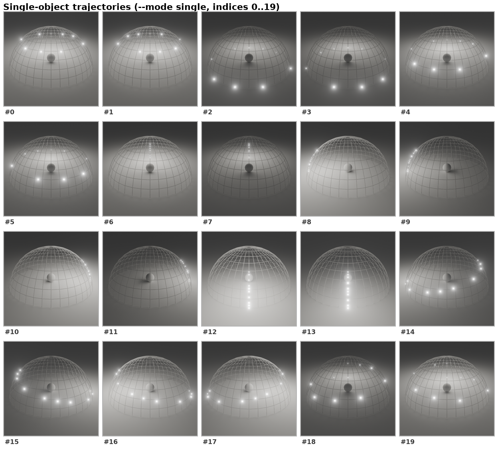
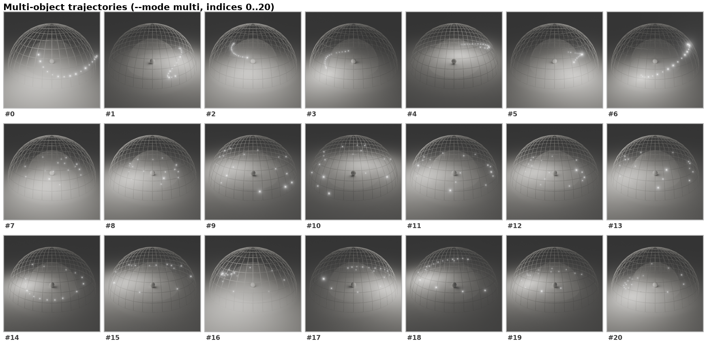

<h1 align="center">GenLit</h1>
<h2 align="center">Reformulating Single-Image Relighting as Video Generation</h2>

<p align="center">
  <a href="https://dl.acm.org/doi/10.1145/3757377.3763970">
    
  </a>
  <a href="https://genlit.is.tue.mpg.de/">
    
  </a>
  <a href="https://arxiv.org/abs/2412.11224">
    
  </a>
  <a href="https://huggingface.co/sbharadwaj/genlit">
    
  </a>
</p>

<p align="center">
  <a href="https://sbharadwajj.github.io/"><strong>Shrisha Bharadwaj*</strong></a>
  ·
  <a href="https://havenfeng.github.io/"><strong>Haiwen Feng*</strong></a>
  ·
  <a href="https://ps.is.mpg.de/person/gbecherini"><strong>Giorgio Becherini</strong></a>
  ·
  <a href="https://vabrevaya.github.io/"><strong>Victoria Fernandez Abrevaya</strong></a>
  ·
  <a href="https://ps.is.tuebingen.mpg.de/person/black"><strong>Michael J. Black</strong></a>
</p>

<h3 align="center">SIGGRAPH Asia 2025</h3>
<p float="center">
  
</p>

GenLit reformulates single-image relighting as image-to-video generation: the scene and object stay
static while the model synthesizes the lighting changes (motion) by moving a point light along a
chosen trajectory on a hemisphere. This repository has the inference code, three pre-trained checkpoints, lighting trajectories, and a Gradio demo.

## Citation

If you find our code or paper useful, please cite as:

```bibtex
@inproceedings{genlit:sigasia:2025,
  title     = {{GenLit}: Reformulating Single Image Relighting as Video Generation},
  author    = {Bharadwaj, Shrisha and Feng, Haiwen and Becherini, Giorgio and
               Abrevaya, Victoria Fernandez and Black, Michael J.},
  year      = {2025},
  isbn      = {979-8-4007-2137-3/2025/12},
  publisher = {Association for Computing Machinery},
  address   = {New York, NY, USA},
  booktitle = {SIGGRAPH Asia Conference Papers '25},
  doi       = {10.1145/3757377.3763970},
}
```
## Gradio demo

<details>
  <summary>Details</summary>

  Run locally:
  ```bash
  pip install -e ".[demo]"
  python demo/app.py
  ```

  Upload an image, pick a mode and trajectory index, click **Generate**. The first run
  downloads the relevant ControlNet checkpoint (~3GB) from HuggingFace.

  To deploy as a HuggingFace Space, copy `demo/app.py`, `demo/requirements.txt`, the
  `genlit/` package, `configs/`, and `trajectories/` into a new Space and select GPU
  hardware. See `demo/README.md` for details.
</details>

## Environment and Setup

<details>
  <summary>Details</summary>

  Clone the repository:
  ```bash
  git clone https://github.com/sbharadwajj/genlit
  cd genlit
  ```

  Create a conda environment and install the package:
  ```bash
  conda create -n genlit python=3.10
  conda activate genlit
  pip install -e .
  ```

  Optional extras:
  ```bash
  pip install -e ".[demo]"   # adds gradio for the local Gradio demo
  pip install -e ".[dev]"    # adds pytest and ruff
  ```

  Authenticate with HuggingFace (the model weights are gated under our non-commercial license):
  ```bash
  huggingface-cli login
  ```
  Accept the license at <https://huggingface.co/sbharadwaj/genlit> once; from then on weights
  download automatically on first inference. Hardware: any CUDA GPU with ≥ 24GB VRAM is enough
  for `single` and `mit` modes; `multi` works best on A100 GPU.
</details>

## Inference

<details>
  <summary>Details</summary>

  We release 3 modes. Both `single` and `multi` work on any images provided. `mit` is intended for the MIT Multi-illumination test set. Please send me an email personally if you want the results on the test-set (30 scenes). I am happy to directly provide them to you. 

  | Mode      | Resolution | Frames | Subject                             |
  |-----------|------------|--------|-------------------------------------|
  | `single`  | 512×512    | 14     | A single foreground object          |
  | `multi`   | 640×448    | 25     | A scene with multiple objects scattered         |
  | `mit`     | 768×512    | 14     | MIT Multi-Illumination test scenes  |

  ### Single object

  ```bash
  python -m genlit.inference \
      --mode single \
      --img_json examples/single.json \
      --output_dir out/single/
  ```

  ### Multi object

  ```bash
  python -m genlit.inference \
      --mode multi \
      --img_json examples/multi.json \
      --output_dir out/multi/
  ```

  ### MIT Multi-Illumination

  Download the MIT Multi-Illumination dataset from
  <https://projects.csail.mit.edu/illumination/> first. The lighting trajectories are in (`trajectories/mit_test_set.npy`).

  ```bash
  python -m genlit.inference \
      --mode mit \
      --mit_data_root /path/to/mit_multi_illumination/ \
      --output_dir out/mit/
  ```

  To quickly verify if your code works correctly, use the subset below:

  ```bash
  python -m genlit.inference \
      --mode mit \
      --mit_test_set trajectories/mit_test_set_small.npy \
      --mit_data_root /path/to/mit_multi_illumination/ \
      --output_dir out/mit/
  ```
</details>

## Choosing trajectories

<details>
  <summary>Details</summary>

  Each lighting trajectory is a 14-frame (single) or 25-frame (multi) sequence of light
  positions on a hemisphere. The repo provides 20 single trajectories and 21 multi trajectories as easy case examples. Consequetive trajectories are mostly the same motion in reverse (for example, #0 and #1 are the same motion in reverse direction).
  Pick any subset with `--trajectory_indices`:

  ```bash
  python -m genlit.inference --mode single \
      --img_json examples/single.json \
      --trajectory_indices 7,12 \
      --output_dir out/
  ```

  If `--trajectory_indices` is omitted, a small default subset (`[0, 2, 3, 4]` for single,
  `[1, 2, 3, 4, 5, 6]` for multi) is used for a quick pass.

  Visualizations of every trajectory:

  | Mode    | Visualization |
  |---------|---------------|
  | single  |  |
  | multi   |  |

  For `single`, the light radius is fixed and the points show the discrete light positions
  across the 14 frames. For `multi`, the radius varies along an arc; the chain of lights
  traces the trajectory across the 25 frames.
</details>


## License

This code and the model weights are released under the
[non-commercial scientific research license](https://genlit.is.tue.mpg.de/license.html);
see [LICENSE](./LICENSE). By downloading or using the code, model weights, or data, you
agree to the terms in the license file.

## Acknowledgements

Built on top of:

- This repository benefits a lot from [SVD Temporal](https://github.com/CiaraStrawberry/svd-temporal-controlnet) and we thank the author for releasing their code as it is impactful for the community.   
- [Stable Video Diffusion](https://huggingface.co/stabilityai/stable-video-diffusion-img2vid)
  and its
  [-xt](https://huggingface.co/stabilityai/stable-video-diffusion-img2vid-xt) variant
- [diffusers](https://github.com/huggingface/diffusers) and
  [HuggingFace Hub](https://huggingface.co/docs/huggingface_hub)
- The [MIT Multi-Illumination](https://projects.csail.mit.edu/illumination/) dataset


